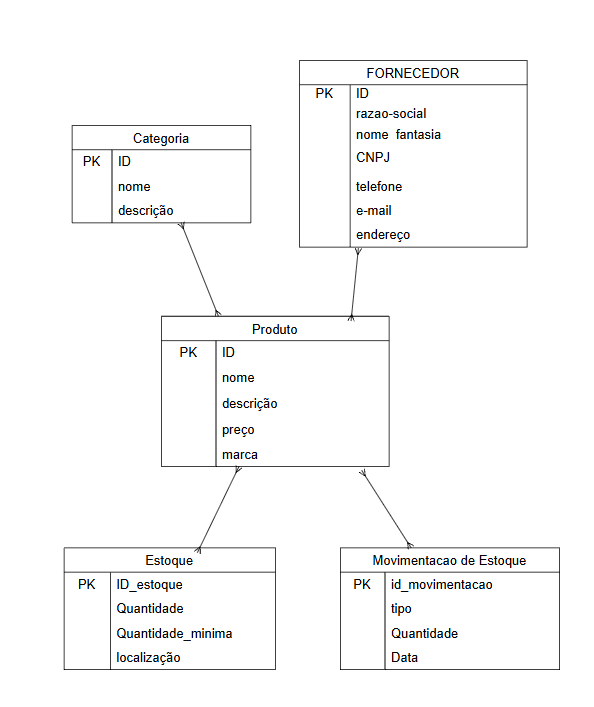
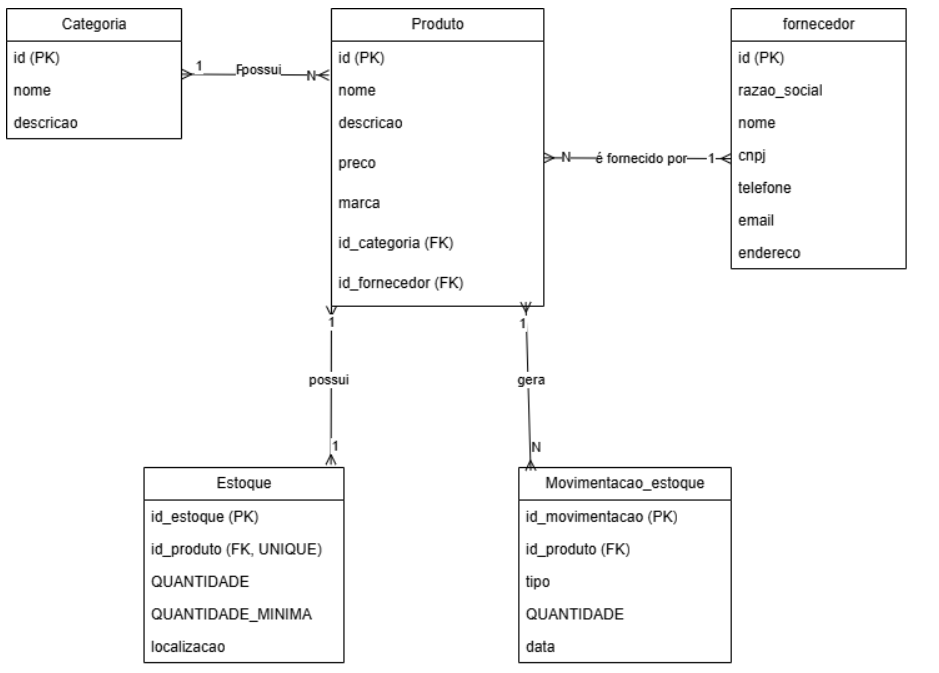

# Projeto: Loja de Roupa

## Ficção de dados

### Categoria
[Categoria.csv](./Categoria.CSV)

| id | nome | descricao |
|---|---|---|
| 1 | Vestido | Vestidos malha leve |
| 2 | Camisa | Camisas Masculinas e Femininas |
| 3 | Blazer | Gola de lapela |

---

### Dicionário
[Dicionario.csv](./Dicionario.CSV)

| entidade | tributo | tipo | tamanho | descricao |
|---|---|---|---|---|
| movimento | id_movimento | int | 11 | Chave primaria do movimento |
| movimento | id_produto | int | 11 | Chave estrangeira que referencia o produto |
| movimento | tipo | varchar | 10 | Indica se o movimento é de entrada ou de saída |
| movimento | quantidade | int | 11 | Quantidade de produtos movimentados |
| movimento | data | date | - | Data em que o movimento foi realizado |
| fornecedor | id | int | 11 | Chave primaria do fornecedor |
| fornecedor | razao_social | varchar | 100 | Razão social do fornecedor |
| fornecedor | nome_fantasia | varchar | 100 | Nome fantasia do fornecedor |
| fornecedor | cnpj | varchar | 18 | CNPJ do fornecedor |
| fornecedor | telefone | varchar | 20 | Telefone de contato do fornecedor |
| fornecedor | email | varchar | 100 | E-mail do fornecedor |
| fornecedor | endereco | varchar | 150 | Endereço do fornecedor |
| produto | id | int | 11 | Chave primaria do produto |
| produto | nome | varchar | 100 | Nome do produto |
| produto | descricao | varchar | 255 | Descrição e características do produto |
| produto | preco | decimal | 10,2 | Preço de venda do produto |
| produto | marca | varchar | 100 | Marca do produto |
| produto | id_categoria | int | 11 | Chave estrangeira que referencia a categoria |
| produto | id_fornecedor | int | 11 | Chave estrangeira que referencia o fornecedor |
| categoria | id | int | 11 | Chave primaria da categoria |
| categoria | nome | varchar | 100 | Nome da categoria |
| categoria | descricao | varchar | 255 | Descrição da categoria |
| estoque | id_estoque | int | 11 | Identificador único do estoque (PK) |
| estoque | id_produto | int | 11 | Identificador do produto (FK) |
| estoque | quantidade | int | 11 | Quantidade atual do produto em estoque |
| estoque | quantidade_minima | int | 11 | Quantidade mínima que deve ser mantida em estoque |
| estoque | localizacao | varchar | 100 | Local onde o produto está armazenado |

---

### Estoque
[Estoque.csv](./Estoque.CSV)

| id_estoque | id_produto | quantidade | quantidade_minima | localizacao |
|---|---|---|---|---|
| 1 | 1 | 20 | 5 | Prateleira A1 |
| 2 | 2 | 10 | 6 | Prateleira A2 |
| 3 | 3 | 10 | 8 | Prateleira B1 |
| 4 | 4 | 40 | 10 | Prateleira B2 |
| 5 | 5 | 0 | 8 | Prateleira C1 |

---

### Fornecedor
[Fornecedor.csv](./Fornecedor.CSV)

| id | razao_social | nome_fantasia | cnpj | telefone | email | endereco |
|---|---|---|---|---|---|---|
| 1 | Cia. Bering | Brening | 81.394.025/0001-44 | (11) 99991-1000 | Bering.loja@gmail.com | R. das Orquideas 140 |
| 2 | Mala de Galinhas Ltda. | Fazenda | 02.485.196/0001-72 | (12) 99992-2000 | Fazenda@gmail.com | Av. Galinheiro 356 |
| 3 | Rara Brasil Ltda. | Rara | 11.602.834/0001-08 | (13) 99993-3000 | Rara.ra@gmail.com | Jd. Raridade 850 |
| 4 | D'ouro brasil Ltda. | D'ouro | 45.912.703/0001-51 | (14) 99994-4000 | D.ouro@gmail.com | R. Mineracao 580 |
| 5 | Doce na cabana Ltda. | Doce & Cabana | 33.154.298/0001-19 | (15) 99995-5000 | Doce_Cabana@gmail.com | Av. Docura 110 |

---

### Movimentação de Estoque
[Movimentação de Estoque.csv](./MovimentaçãodeEstoque.CSV)

| id_movimentacao | id_produto | tipo | quantidade | data |
|---|---|---|---|---|
| 1 | 1 | entrada | 40 | 01/10/2026 |
| 2 | 2 | entrada | 20 | 02/10/2026 |
| 3 | 2 | saida | 30 | 22/10/2026 |
| 4 | 1 | saida | 20 | 15/10/2026 |
| 5 | 4 | entrada | 60 | 03/10/2026 |
| 6 | 3 | entrada | 10 | 06/10/2026 |
| 7 | 3 | saida | 50 | 28/10/2026 |
| 8 | 4 | saida | 20 | 25/10/2026 |

---

### Produto
[Produto.csv](./Produto.CSV)

| id | nome | descricao | preco | marca | id_categoria | id_fornecedor |
|---|---|---|---:|---|---:|---:|
| 1 | Camisa Basica | Manga curta e malha leve | 29 | 74 | 2 | 1 |
| 2 | Vestido Cropped | Alças finas e decote reto | 99 | Fazenda | 1 | 2 |
| 3 | Blazer | Manga drapeada e gola de lapela | 399 | Rara | 3 | 3 |
| 4 | Vestido Dioriviera | Cor rosa e algodão leve | 22000.00 | D'ouro | 1 | 4 |
| 5 | Camisa com Logo | Cor preta e inteiramente em algodão | 3400 | Doce e Cabana | 2 | 5 |

---

## MER DER Conceitual

---

## MER DER Lógico

